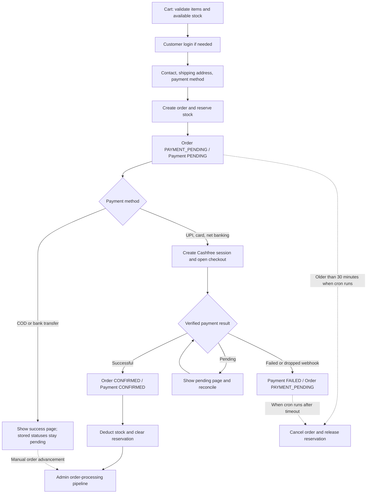
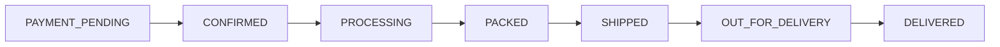
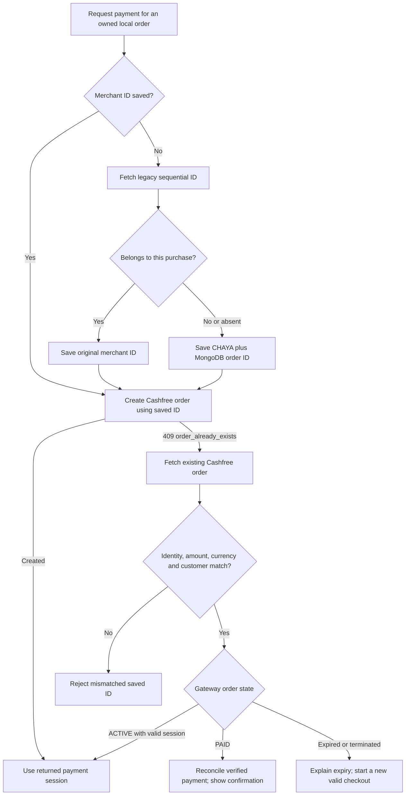

# Order and shipping process flow

Reviewed against the current source on 2026-09-20. Checkout, payment handling,
inventory operations, and the admin order pipeline exist. Shipping has a model,
server actions, and a listing, but the operational workflow is incomplete.

This review covers source behavior and an isolated, in-memory payment check.
It does not verify deployed cron configuration, real payments, courier activity,
or delivery. No live records were changed.

## 1. Current customer-to-order flow

| Step | Customer / operator action       | What the application does                                                                                                                                                                                                                                                               |
| ---- | -------------------------------- | --------------------------------------------------------------------------------------------------------------------------------------------------------------------------------------------------------------------------------------------------------------------------------------- |
| 1    | Add products to the cart         | Stores the cart locally and synchronizes a temporary cart in MongoDB. Cart validation checks product availability and stock less reservations.                                                                                                                                          |
| 2    | Select Proceed to checkout       | Calls `validateCart()`, then opens `/checkout`. The proxy requires a customer session and redirects signed-out users to login with a return URL.                                                                                                                                        |
| 3    | Complete checkout                | Collects contact details, shipping address, and payment method in three steps. Existing customer details and the first saved address prefill the form. Billing uses the shipping address.                                                                                               |
| 4    | Submit the order                 | `placeOrder()` resolves product variants and prices from MongoDB, recalculates totals, generates `ORD-<year>-<sequence>`, saves the customer/address and order, and reserves inventory in a transaction.                                                                                |
| 5    | Initial state                    | Every payment method starts with `orderStatus = PAYMENT_PENDING` and `paymentStatus = PENDING`, including COD and bank transfer.                                                                                                                                                        |
| 6A   | Pay by UPI, card, or net banking | Creates a Cashfree order using the stored total and persisted `cashfreeOrderId` (`CHAYA_<MongoDB order ID>` for new purchases), then opens Cashfree checkout in a modal. Display order numbers remain unchanged.                                                                        |
| 6B   | Choose COD or bank transfer      | Skips Cashfree, clears the cart, and opens the success page. The stored order remains payment-pending; this branch does not automatically confirm it.                                                                                                                                   |
| 7    | Payment confirmation             | The Cashfree webhook verifies its signature, merchant ID, amount, currency, and customer. Legacy sequential IDs also require a gateway lookup to check creation time. Successful payment sets both statuses to `CONFIRMED`, deducts stock, and clears the reservation in a transaction. |
| 8    | Return to the site               | `/checkout/success?order=...` reads the order status. Pending online payments trigger a Cashfree lookup and up to ten refreshes at five-second intervals. Account dashboard/order-history views also reconcile online payments still marked `PENDING`.                                  |
| 9    | View purchases                   | `/account/orders` displays items, payment status, order status, amount, and shipping address. Its Track Order link opens the currently disabled public tracking form.                                                                                                                   |

Source: [cart actions](../lib/actions/cart.actions.ts),
[checkout UI](<../app/(public)/checkout/CheckoutClient.tsx>),
[checkout actions](../lib/actions/checkout.actions.ts),
[payment webhook](../app/api/webhooks/cashfree/route.ts),
[success page](<../app/(public)/checkout/success/page.tsx>).

The timeout query selects by order status and creation time only. It does not
exclude COD or bank transfer, and it does not first check Cashfree for a missed
successful payment.

## 2. Current admin processing and shipping flow

Open **Admin > Orders > an order**. The Processing Pipeline button advances
the order through this sequence:

These are manual order-status changes. The button calls `updateOrderStatus()`;
it does not book a courier, create a shipment, assign an AWB/tracking number,
confirm payment, update stock, or notify the customer. The server validates
the status name but does not enforce the transition sequence or a payment gate.

The separate shipment actions support the following behavior:

| Action / screen          | Current behavior                                                                                                                         | Availability                                             |
| ------------------------ | ---------------------------------------------------------------------------------------------------------------------------------------- | -------------------------------------------------------- |
| `createShipment()`       | Requires an order ID, courier name, tracking number, and items. Creates a `PENDING` shipment. Can optionally set the order to `SHIPPED`. | Backend exists; no caller/form found in the application. |
| `updateShipmentStatus()` | Updates the shipment; sets `shippedAt` or `deliveredAt` and optionally copies the status onto the order.                                 | Backend exists; no caller/form found in the application. |
| `/admin/shipments`       | Lists shipment number, order, courier, tracking number, status, and a dispatch-date column.                                              | Implemented listing.                                     |
| Shipment detail link     | Points to `/admin/shipments/[id]`.                                                                                                       | No matching detail route found.                          |
| Courier integration      | Serviceability, rate quotes, booking, labels, pickup, courier events.                                                                    | No provider integration found.                           |
| `/track-order`           | Shows order-number/contact inputs and WhatsApp/call support links.                                                                       | Track button is disabled; no lookup is wired.            |

`ShippingService.checkCodEligibility()` contains a value limit of INR 50,000,
but no call sites were found. PIN-code serviceability is a TODO. Checkout
currently offers COD without using that eligibility check.

Source: [processing card](../components/admin/orders/processing-card.tsx),
[order actions](../lib/actions/order.actions.ts),
[shipment actions](../lib/actions/shipment.actions.ts),
[shipment table](../components/admin/shipments/ShipmentsTable.tsx),
[shipping service](../lib/services/shipping.ts),
[public tracking page](<../app/(public)/track-order/page.tsx>).

## 3. Status and inventory responsibilities

The application stores order, payment, and shipment statuses separately.

| Record        | Statuses in the model                                                                                                                          |
| ------------- | ---------------------------------------------------------------------------------------------------------------------------------------------- |
| Order         | `PAYMENT_PENDING`, `CONFIRMED`, `PROCESSING`, `PACKED`, `SHIPPED`, `OUT_FOR_DELIVERY`, `DELIVERED`, `CANCELLED`, `DELIVERY_FAILED`, `RETURNED` |
| Order payment | `PENDING`, `CONFIRMED`, `FAILED`                                                                                                               |
| Shipment      | `PENDING`, `SHIPPED`, `DELIVERED`, `RETURNED`                                                                                                  |

Shipment status does not currently include `OUT_FOR_DELIVERY` or
`DELIVERY_FAILED`, although the order lifecycle supports both.

| Event                                                       | Inventory operation                                               |
| ----------------------------------------------------------- | ----------------------------------------------------------------- |
| Order creation                                              | Increase `reservedQuantity`; keep physical `stock` unchanged.     |
| Successful online payment                                   | Decrease `stock` and `reservedQuantity`.                          |
| Timeout cancellation                                        | Decrease `reservedQuantity`.                                      |
| Admin cancellation with payment `PENDING`                   | Release reservation.                                              |
| Admin cancellation with payment `CONFIRMED` **or `FAILED`** | Increase physical stock. Treating `FAILED` as finalized is a bug. |
| Order status advanced to shipped/delivered                  | No inventory operation.                                           |
| Return approved/refunded from pending inspection            | Restock returned items and mark the order `RETURNED`.             |

`available = max(0, stock - reservedQuantity)`.
The inventory helpers also recalculate the product's stock-status badge.

Cancellation, manual payment recording, and return-processing actions exist,
but no UI callers for their mutation functions were found. Refund processing
records a refund amount/status; no Cashfree refund request is implemented.
Order-confirmation and shipping email/SMS/WhatsApp automation were not found.

Source: [inventory](../lib/inventory.ts), [order model](../lib/models/order.ts),
[shipment model](../lib/models/shipment.ts),
[manual payments](../lib/actions/payment.actions.ts),
[return actions](../lib/actions/return.actions.ts).

## 4. Shipping charge calculation

The cart and checkout currently use different rules:

| Location               | Shipping charge | Free-shipping condition              |
| ---------------------- | --------------- | ------------------------------------ |
| Cart                   | INR 200         | Subtotal **greater than INR 50,000** |
| Checkout / saved order | INR 500         | Subtotal **greater than INR 25,000** |

At exactly INR 25,000, checkout still charges INR 500. At exactly INR 50,000,
the cart still charges INR 200. For a subtotal of INR 10,000, the cart shows
INR 10,200; checkout calculates INR 10,800, including its INR 500 shipping
fee and INR 300 tax.

The checkout code applies a fixed 3% tax calculation, with Maharashtra as its
merchant-state constant. This documents the implemented formula; tax-policy
correctness was not assessed. Prices come from stored variants at order creation.

Source: [cart settings](<../app/(public)/cart/page.tsx>),
[cart totals](<../app/(public)/cart/cart-view.tsx>),
`calculateOrderTotals()` in [checkout actions](../lib/actions/checkout.actions.ts).

## 5. Gaps found, in priority order

| Priority                     | Finding                                                                                                                                                                                      | Effect and required correction                                                                                                                                                                                                                                                                      |
| ---------------------------- | -------------------------------------------------------------------------------------------------------------------------------------------------------------------------------------------- | --------------------------------------------------------------------------------------------------------------------------------------------------------------------------------------------------------------------------------------------------------------------------------------------------- |
| Fixed: trusted payment proof | `finalizeCashfreePayment()` previously accepted caller-supplied payment data.                                                                                                                | It now always fetches Cashfree using the saved merchant ID and verifies identity, amount, currency, and customer before confirmation. Legacy IDs also require a creation-time check. Action authorization remains the separate issue below.                                                         |
| High                         | Checkout actions do not consistently enforce customer identity and order ownership. `placeOrder()` allows a missing session; payment-session creation/status lookup operate by order number. | Enforce authentication and ownership inside each action. The checkout page's proxy protection does not cover every way a Server Action can be invoked.                                                                                                                                              |
| High                         | Order history matches `userId OR email`, while the order stores the editable checkout email from the submitted payload.                                                                      | An order addressed to another registered email can appear in that account even when bound to a different user. Scope account history by authoritative ownership; separate contact email from account identity.                                                                                      |
| High                         | COD and bank-transfer orders remain `PAYMENT_PENDING`.                                                                                                                                       | The timeout job can cancel accepted offline-payment orders after 30 minutes. Define distinct offline-payment acceptance/expiry rules and enforce COD eligibility.                                                                                                                                   |
| High                         | Payment completion and expiry are separate operations without an atomic order-state guard.                                                                                                   | A late success can revive a cancelled order; concurrent reconciliation/webhook work can repeat inventory effects. Use one idempotent finalization path and coordinate cancellation with gateway reconciliation.                                                                                     |
| High                         | Admin processing bypasses payment and shipment requirements.                                                                                                                                 | An unpaid order can be advanced through delivery with no shipment. Enforce allowed transitions and method-specific payment checks on the server; require shipment details for dispatch.                                                                                                             |
| High                         | Cancelling a `FAILED` payment order restocks it instead of releasing its reservation.                                                                                                        | Physical stock can be overstated. Base stock changes on whether stock was actually finalized, and handle failed/unpaid orders correctly.                                                                                                                                                            |
| High                         | Shipping creation, shipment updates, courier tracking, and the public tracking lookup are not connected to usable UI.                                                                        | An order status of `SHIPPED` does not establish that a courier shipment exists. Add creation/detail/update screens and customer tracking, then connect a provider or an explicit manual dispatch process.                                                                                           |
| Medium                       | Cart and checkout shipping prices disagree.                                                                                                                                                  | Customers see a different charge at checkout. Use one server-owned shipping policy for both screens and order creation.                                                                                                                                                                             |
| Medium                       | Missing/unknown order numbers fall through to the success screen; pending/redirect flows also clear the cart before confirmed payment.                                                       | A customer can see success or lose their retry cart before payment is confirmed. Require a valid owned order and explicit success state; retain retry information for pending/failed payments.                                                                                                      |
| Medium                       | Repeated checkout submission creates another order and reservation.                                                                                                                          | Payment cancellation/session failures followed by retry can leave multiple pending orders. Reuse a valid pending order/payment session or add checkout idempotency.                                                                                                                                 |
| Fixed: duplicate IDs         | Reused display numbers collided with older Cashfree purchases.                                                                                                                               | New purchases use persisted merchant IDs derived from their MongoDB IDs. Legacy collisions move to that ID on session creation; matching legacy payments retain their original ID. Retries reuse matching active sessions; see section 8.                                                           |
| Medium                       | Shipment timestamps and statuses are inconsistent across layers.                                                                                                                             | The table reads `dispatchDate`, but the model/actions write `shippedAt`. Shipment creation can mark the order shipped while keeping shipment status pending; status updates accept an arbitrary string and omit update validators. Align fields, validate statuses, and map transitions explicitly. |
| Operational                  | A timeout endpoint exists, but no repository cron schedule was found. Its authorization check is conditional on `CRON_SECRET` being set.                                                     | Verify the actual hosting scheduler separately and make the secret mandatory. The existence of the endpoint alone does not establish that reservations are released automatically.                                                                                                                  |

`nextAllowed` rules exist in `lib/config/statusMaps.ts`, but the order-update
action does not use them. Manual payment actions can confirm payment without
advancing an order out of `PAYMENT_PENDING`. Gateway confirmation also does
not create a `Payment` collection record, so the separate admin Payments list
is not a complete Cashfree transaction ledger.

## 6. Proposed completed operational flow

1. **Cart and login:** validate current prices, active products, quantity, and
   stock; identify the customer from the server session.
2. **Address and delivery:** validate the address/PIN code, serviceability,
   shipping charge, and COD availability using one policy.
3. **Order placement:** create one order per checkout attempt and reserve stock.
4. **Payment decision:** verify online payment before fulfillment; explicitly
   accept eligible COD orders with payment due on delivery; hold bank-transfer
   orders for verified receipt under a defined expiry policy.
5. **Fulfillment:** admin accepts the order, picks items, completes quality
   checks, and packs them. Enforce the permitted transition at each step.
6. **Dispatch:** create the shipment, record courier and AWB/tracking number,
   produce required shipping documents, arrange pickup, and mark shipped only
   once dispatch is established. For COD, finalize reserved stock at the
   chosen fulfillment milestone rather than waiting indefinitely for payment.
7. **Tracking and delivery:** update shipment and order consistently from
   verified courier events or authorized manual updates. Show tracking to the
   owning customer, send status notifications, and reconcile COD collection.
8. **Exceptions:** release reservations on unpaid expiry, reconcile late
   payments safely, handle failed delivery/return-to-origin, inspect physical
   returns before restocking, and issue/record actual refunds when applicable.

Choose the manual-dispatch or courier-integration approach before completing
the shipping UI; both need a recorded shipment and a reliable source of delivery
updates.

## 7. Verification performed

- Traced cart, checkout, Cashfree webhook/reconciliation, inventory, admin
  processing, shipment actions/screens, tracking, cancellation, and return code.
- Searched application call sites and routes to distinguish connected features
  from backend-only functions and missing detail pages.
- Used the real checkout-action code with mocked dependencies to confirm that
  supplied payment data can bypass both gateway lookup and authentication.
  All records and inventory operations in this check were in memory.
- Checked the checkout shipping threshold and example totals in the same
  isolated harness; compared them with the cart's configured values.
- No production build, live order creation, payment, shipment, or cancellation
  was required for this documentation review.

## 8. Reported error: order with same ID is already present

The exact message is documented by Cashfree as HTTP `409` with code
`order_already_exists`: [Create Order API](https://www.cashfree.com/docs/api-reference/payments/latest/orders/create-order).
It means the supplied merchant order ID already exists in the selected Cashfree
account/environment. It does not, by itself, mean the customer has paid.

### Original failure, before the fix

1. `createCashfreePaymentSession(orderNumber)` loads the local order and calls
   `createCashfreeOrder()`.
2. The service always sends `POST /pg/orders`, with the local `orderNumber`
   as Cashfree's `order_id`.
3. If that ID already exists, Cashfree returns the duplicate-order error.
4. The service throws Cashfree's message; the server action returns it to
   checkout, which shows the error toast. No existing session is retrieved.

An isolated check using the real service code and mocked HTTP responses
reproduced this: two attempts sent two POST requests with the same ID, both
surfaced the error, and neither attempted a GET. No live orders were created.

### Confirmed cause in this checkout

- A previous create-order request succeeded, but the browser/payment SDK or
  subsequent response handling failed. Repeating session creation for that
  local order then conflicts with the already-created gateway order.
- Two requests try to create the same gateway order concurrently.
- Display order numbers can repeat after a counter/database reset or when
  separate databases share Cashfree credentials. The exact reason the sequence
  was reused has not been established.

A read-only check on 2026-09-20 confirmed real collisions: local orders
`ORD-2026-0003` through `ORD-2026-0007` were created on September 20, while
Cashfree already held those IDs from September 18–19. Amounts, phone numbers,
and emails differed. All five gateway orders were still `ACTIVE`. The mismatch
guard correctly refused to hand out another purchase's session; the missing
piece was a unique, persisted payment ID for the current purchase.

The normal checkout submit handler currently calls `placeOrder()` again on
every submission, so a complete retry usually creates a new local order number.
That is a separate duplicate-purchase/reservation problem. The reported Cashfree
message specifically establishes reuse of an existing gateway ID.

### Recommended complete retry flow

Cashfree's [Get Order API](https://www.cashfree.com/docs/api-reference/payments/latest/orders/get-order)
returns order status and payment-session information. Reuse must verify that
the gateway record belongs to this purchase; a matching sequence number alone
is insufficient if local data has been reset. A paid order must be reconciled
from a trusted server lookup without requesting another payment.

Also add a stable per-order idempotency key for create-order retries, prevent
parallel submissions, and preserve the pending local order for a retry of the
same checkout. Do not append a random suffix only to Cashfree's ID: webhook
and reconciliation must use the persisted mapping for every payment callback.

### Implemented fix

1. `placeOrder()` generates a server-owned MongoDB ID and persists
   `cashfreeOrderId = CHAYA_<MongoDB ID>` for online purchases. The public
   `ORD-<year>-<sequence>` number and success-page URL stay unchanged.
2. Existing orders without a mapping first look up their legacy Cashfree ID.
   Matching identity, amount, currency, customer, and creation time preserve
   that ID, including when already paid. A different purchase or a confirmed
   404 gets the unique MongoDB-derived ID. Failed lookups never create a
   replacement payment. The binding is saved atomically before the gateway POST.
3. HTTP `409` / `order_already_exists` still triggers retrieval and reuse of a
   matching `ACTIVE` payment session. Retries and lost responses keep the saved
   ID. Paid sessions return an already-paid message; expired/closed sessions
   require a fresh checkout.
4. Webhooks and account/success-page reconciliation use the saved merchant ID.
   A webhook with the old sequential ID cannot update a purchase after it has
   moved to its unique ID. Unbound legacy callbacks must first pass the gateway
   identity/creation-time check. Reconciliation always fetches trusted gateway
   data instead of accepting caller-supplied payment proof.

Restart the development server after this schema change so Mongoose reloads
the new field. No bulk data migration or counter reset is required; pending
legacy orders are bound when payment-session creation is retried.

Regression coverage: `tests/cashfree.test.cjs` and `tests/cashfree-flow.test.cjs`
exercise service recovery, order creation, persisted bindings, collisions,
concurrent binding selection, timeout retries, legacy payments, reconciliation,
and signed webhook routing using isolated HTTP/database fixtures. No live
payment or database record is created by these tests. Checkout-level duplicate
submission prevention, automatic paid-order reconciliation in session creation,
and action authorization remain separate work.
